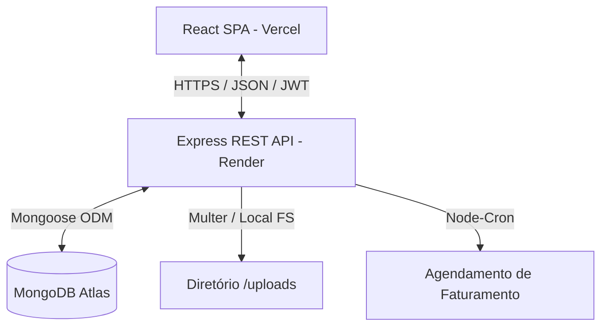

# ⚡ Arquitetura e Stack Tecnológica do AP RASTRO

Este documento apresenta em detalhes a arquitetura de software, a pilha tecnológica adotada, a estrutura organizacional dos diretórios e os padrões de segurança e comunicação do ecossistema **AP RASTRO**.

---

## 🏗️ Visão Geral da Arquitetura

O sistema é baseado em uma arquitetura **Client-Server** desacoplada:
*   **Frontend**: Uma aplicação de página única (SPA - Single Page Application) altamente responsiva e dinâmica, construída em React, TypeScript e compilada através do Vite.
*   **Backend**: Uma RESTful API desenvolvida em Node.js com Express e TypeScript, utilizando o MongoDB como banco de dados NoSQL (gerenciado pelo ODM Mongoose).



---

## 🛠️ Stack Tecnológica

### Frontend
- **Framework Core**: React (v18+) com TypeScript.
- **Ferramental de Build**: Vite (para compilação ultrarrápida em desenvolvimento e empacotamento otimizado de produção).
- **Estilização**: CSS Nativo Customizado, utilizando variáveis CSS globalizadas para temas coerentes e responsividade fluida. Evita dependências de frameworks pesados, prezando por performance.
- **Roteamento**: Controlado no estado da aplicação cliente (SPA), alternando abas e seções dinamicamente.
- **Comunicação de Rede**: Módulo customizado usando a Fetch API nativa (`api.ts`), com interceptação para injeção automática de cabeçalhos de autenticação JWT e tratamento global de erros HTTP.
- **Hospedagem/Deploy**: Vercel.

### Backend
- **Ambiente de Execução**: Node.js (versão >= 20.0.0).
- **Linguagem**: TypeScript para tipagem estática e segurança em tempo de desenvolvimento.
- **Framework Web**: Express (v5.0+), provendo roteamento REST rápido e middleware flexível.
- **Acesso ao Banco de Dados**: Mongoose (v9.0+), que atua como ODM (Object Data Modeling) para prover validação de dados, esquemas rígidos e facilidade de consultas ao MongoDB.
- **Autenticação**: JWT (JSON Web Tokens) com criptografia `HS256` via biblioteca `jsonwebtoken`.
- **Criptografia de Senhas**: Criptografia Hash unidirecional via `bcryptjs`.
- **Agendamento de Tarefas**: `node-cron` para execução automatizada diária da rotina de faturamento.
- **Gerenciamento de Uploads**: `multer` para upload de arquivos multipart/form-data e armazenamento físico em disco local.
- **Hospedagem/Deploy**: Render.

---

## 📂 Estrutura de Diretórios e Padrões de Código

### Estrutura do Backend
O backend segue um padrão de **módulos verticais**, agrupando controllers, models e rotas por domínio de negócio:
```
backend/
├── src/
│   ├── config/              # Configurações globais (banco de dados, middlewares globais)
│   ├── modules/             # Módulos de domínio de negócio
│   │   ├── auth/            # Login e token JWT
│   │   ├── clientes/        # Cadastro e panoramas de clientes
│   │   ├── ordens/          # Fluxo de Ordens de Serviço (O.S.)
│   │   ├── financeiro/      # Faturamento, faturas e pagamentos
│   │   └── ...              # Outros módulos
│   ├── scripts/             # Scripts utilitários de banco (ex: inject_admin, seeds)
│   ├── utils/               # Funções auxiliares (ex: envio de e-mails)
│   ├── app.ts               # Setup principal do Express e middlewares
│   └── server.ts            # Inicialização do servidor HTTP e conexão do banco
├── uploads/                 # Diretório físico para armazenamento de fotos das O.S.
└── tsconfig.json            # Configuração do TypeScript compiler
```

-   **Padrão Router-Controller-Model**:
    -   `*.routes.ts`: Define os caminhos da API, métodos HTTP e associa handlers.
    -   `*.controller.ts`: Contém a lógica de tratamento da requisição, validações preliminares de payload, chamadas ao banco e formatação de respostas HTTP.
    -   `*.model.ts`: Declara as interfaces do TypeScript e os schemas correspondentes do Mongoose com suas validações nativas.

### Estrutura do Frontend
O frontend está organizado de maneira modular:
```
frontend/
├── src/
│   ├── assets/              # Mídias estáticas (logos, ícones)
│   ├── components/          # Componentes reusáveis (Sidebar, Login, Gestão de Usuários)
│   │   ├── dashboard/       # Widgets e cartões de estatísticas do dashboard
│   │   └── layout/          # Estruturas de layout global
│   ├── services/            # Serviços de integração (api.ts concentrando chamadas)
│   ├── utils/               # Formatação de datas, moedas e máscaras de inputs
│   ├── App.tsx              # Componente central agregador de estado e visualização
│   └── main.tsx             # Ponto de entrada do React
├── index.html               # Template HTML5 principal
└── vite.config.ts           # Configurações de compilação do Vite
```

---

## 🔐 Segurança e Comunicação

### Autenticação via JSON Web Token (JWT)
O controle de acesso é realizado por meio de autenticação stateless via token JWT:
1.  O cliente envia o `email` e a `senha` para `/api/auth/login`.
2.  O servidor valida as credenciais contra a senha encriptada com `bcrypt` no banco de dados.
3.  Se válidas, o servidor assina um token contendo `_id`, `role` (ex: `admin`, `tecnico`) e `tecnicoId` (se aplicável), com validade de 7 dias (`7d`).
4.  O cliente armazena o token no `localStorage` sob a chave `aprastro_token`.
5.  Para todas as requisições subsequentes, o cliente insere o token no cabeçalho `Authorization: Bearer <token>`.

> [!NOTE]
> **Observação de Arquitetura (Dívida Técnica)**: No estágio atual do backend, embora o frontend já passe o token JWT no cabeçalho `Authorization`, as rotas do backend não possuem o middleware de interceptação obrigatório ativo para validar este token. Recomenda-se a implementação imediata de um middleware de validação global de JWT no backend antes de expor a API à rede pública irrestrita.

### Política de CORS Dinâmica
A API possui uma configuração robusta de CORS (`Cross-Origin Resource Sharing`) para bloquear acessos não autorizados a partir de domínios externos:
*   **Origens Permitidas (Whitelist)**:
    -   `http://localhost:5173` (Ambiente padrão de desenvolvimento do Vite).
    -   `http://localhost:5174` (Porta alternativa de desenvolvimento).
    -   `https://aprastreamento.vercel.app` (Ambiente de produção homologado).
    -   Qualquer subdomínio dinâmico gerado pela Vercel que termine em `.vercel.app` e contenha `aprastreamento`.
    -   Opcionalmente, a URL definida na variável de ambiente `FRONTEND_URL`.
*   **Comportamento**: Requests que não informarem a origem (como ferramentas internas do Render ou requisições de servidores internos) são aceitos para permitir testes de integridade operacional.

### Armazenamento de Arquivos Físicos
Os uploads de imagens de ordens de serviço e auditorias são interceptados pelo middleware `multer` no backend.
-   As mídias são gravadas diretamente no diretório `backend/uploads/` do servidor local.
-   A rota `/uploads` do Express expõe essa pasta publicamente por meio do middleware estático do Express:
    `app.use('/uploads', express.static(path.join(__dirname, '../uploads')));`
-   Em ambientes de produção hospedados no Render, a persistência dessas imagens exige a montagem de um **Persistent Volume**, uma vez que os contêineres padrão possuem sistema de arquivos efêmero (que é apagado a cada novo build/restart).
