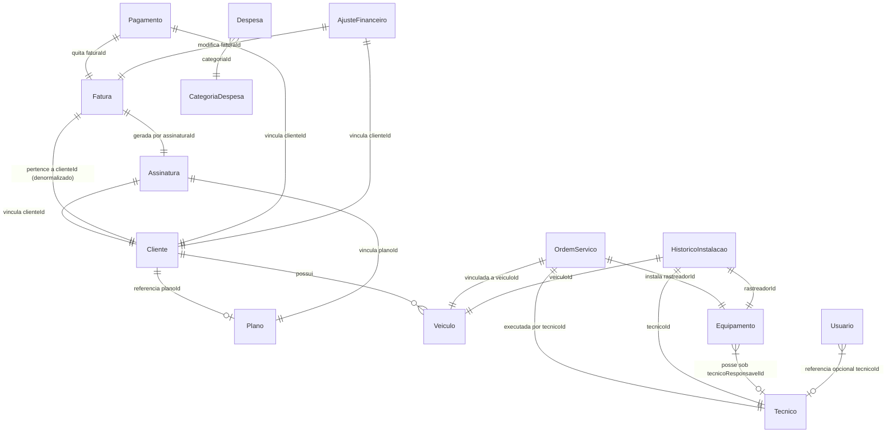

# 💾 Modelagem do Banco de Dados

Este documento descreve detalhadamente o design do banco de dados do **AP RASTRO**. O sistema utiliza o **MongoDB** como banco de dados NoSQL orientado a documentos, estruturado através do ODM **Mongoose**.

---

## 🔀 Relacionamentos e Modelo Conceitual

Embora o MongoDB seja um banco não-relacional, a lógica de negócios do AP RASTRO exige relacionamentos lógicos (referências via `ObjectId`). O diagrama a seguir ilustra como as principais coleções se conectam:

---

## 📋 Detalhamento das Coleções e Schemas (Mongoose)

Abaixo estão descritas as estruturas físicas de todas as coleções do banco de dados, incluindo tipos de dados, validações nativas e regras de indexação.

---

### 1. Clientes (`Cliente`)
Armazena os dados cadastrais e o status operacional dos clientes contratantes.

-   **Coleção**: `clientes`
-   **Estrutura do Schema**:
    *   `nome` (String, obrigatório, trim, indexado): Nome completo ou razão social.
    *   `documento` (String, obrigatório, único, trim): CPF ou CNPJ (chave de integridade exclusiva).
    *   `email` (String, trim, lowercase): E-mail para contato.
    *   `whatsapp` (String, trim): WhatsApp do cliente.
    *   `endereco` (Sub-documento embutido, sem `_id` próprio):
        *   `rua` (String, trim)
        *   `numero` (String, trim)
        *   `bairro` (String, trim)
        *   `cidade` (String, trim)
        *   `uf` (String, trim)
        *   `cep` (String, trim)
    *   `ativo` (Boolean, padrão: `true`, indexado): Status operacional do cliente.
    *   `indicacao` (String, trim): Nome de quem indicou o cliente.
    *   `motivoInativacao` (String, trim): Motivo em caso de cancelamento.
    *   `detalhesInativacao` (String, trim): Detalhes textuais adicionais do cancelamento.
    *   `dataInativacao` (Date): Data exata do encerramento do contrato.
    *   `operadorCancelamento` (String, trim): Nome/ID do operador que efetuou a inativação.
    *   `planoId` (ObjectId, referência a `Plano`, padrão: `null`): Plano financeiro atual vinculado ao cliente.
    *   `diaVencimento` (Number, padrão: `10`, enum: `[5, 10, 15, 20, 25]`): Dia padrão de vencimento das faturas mensais.
    *   `timestamps` (createdAt, updatedAt): Gerados automaticamente.

---

### 2. Veículos (`Veiculo`)
Armazena a frota cadastrada associada a cada cliente.

-   **Coleção**: `veiculos`
-   **Estrutura do Schema**:
    *   `clienteId` (ObjectId, referência a `Cliente`, obrigatório, indexado): Dono do veículo.
    *   `ativo` (Boolean, padrão: `true`, indexado): Status operacional.
    *   `placa` (String, obrigatório, único, trim, uppercase): Placa Mercosul ou convencional do veículo.
        *   *Validador Nativo*: `/^[A-Z]{3}[0-9][A-Z0-9][0-9]{2}$/` (Garante formato limpo de placa).
    *   `marca` (String, trim): Fabricante (ex: Fiat, Chevrolet).
    *   `modelo` (String, trim): Modelo (ex: Uno, Onix).
    *   `cor` (String, trim): Cor predominante.
    *   `ano` (String, trim): Ano de fabricação/modelo.
    *   `chassi` (String, trim): Código do chassi.
    *   `renavam` (String, trim): Código do renavam.
    *   `timestamps`: Gerados automaticamente.

---

### 3. Planos (`Plano`)
Define as políticas comerciais, preços e regras de fidelidade para faturamento.

-   **Coleção**: `planos`
-   **Estrutura do Schema**:
    *   `nome` (String, obrigatório, único, trim): Identificação comercial do plano.
    *   `tipoCobranca` (String, obrigatório, enum: `['POR_VEICULO', 'FIXO_GLOBAL', 'ESCALONADO_FROTA']`):
        *   `POR_VEICULO`: Valor unitário multiplicado pela quantidade de rastreadores ativos.
        *   `FIXO_GLOBAL`: Valor fechado independente da frota.
        *   `ESCALONADO_FROTA`: Tabela de preço regressiva ou por faixas.
    *   `periodicidade` (String, obrigatório, enum: `['MENSAL', 'BIMESTRAL', 'TRIMESTRAL', 'SEMESTRAL', 'ANUAL']`, padrão: `'MENSAL'`): Frequência do faturamento.
    *   `valorBase` (Number, padrão: `0`, mínimo: `0`): Valor padrão de cobrança (aplicável em `POR_VEICULO` ou `FIXO_GLOBAL`).
    *   `faixasPreco` (Array de objetos embutidos, sem `_id` próprio, aplicável apenas em `ESCALONADO_FROTA`):
        *   `de` (Number, obrigatório, min: `1`): Início da faixa de veículos.
        *   `ate` (Number, opcional): Fim da faixa. Se nulo, representa a última faixa aberta.
        *   `valor` (Number, obrigatório, min: `0`): Valor por veículo aplicado nesta faixa.
    *   `fidelidadeMeses` (Number, padrão: `0`, min: `0`): Período mínimo de contrato (em meses).
    *   `descontoFidelidadePct` (Number, padrão: `0`, min: `0`, max: `100`): Percentual de abatimento concedido pela fidelidade contratada.
    *   `descricao` (String, trim): Descrição das coberturas do plano.
    *   `ativo` (Boolean, padrão: `true`): Status de venda do plano.

---

### 4. Equipamentos/Rastreadores (`Equipamento`)
Estoque e logística de hardware de rastreamento e chips SIM M2M vinculados.

-   **Coleção**: `equipamentos`
-   **Estrutura do Schema**:
    *   `identificador` (String, obrigatório, único, trim): Número do IMEI do rastreador.
    *   `ativo` (Boolean, padrão: `true`, indexado): Status físico de operação.
    *   `iccid` (String, trim): Número serial do cartão SIM embutido.
    *   `numeroLinha` (String, trim): Número de telefone associado ao chip.
    *   `operadora` (String, trim): Operadora celular (ex: Vivo, Claro, Algar, Arqia).
    *   `apn` (String, trim): Access Point Name configurado no chip para tráfego de dados.
    *   `marca` (String, trim): Fabricante do rastreador (ex: Coban, Suntech, Queclink).
    *   `modelo` (String, trim): Modelo de hardware (ex: TK303, ST310U).
    *   `status` (String, obrigatório, enum: `['ESTOQUE', 'COM_TECNICO', 'INSTALADO', 'DEFEITUOSO', 'DEV_FORNECEDOR']`, padrão: `'ESTOQUE'`): Localização lógica atual do hardware.
    *   `tecnicoResponsavelId` (ObjectId, referência a `Tecnico`, padrão: `null`): Técnico que está em posse física do rastreador quando status for `COM_TECNICO`.
    *   `timestamps`: Gerados automaticamente.

---

### 5. Técnicos (`Tecnico`)
Cadastro dos profissionais autorizados a realizar ordens de serviço.

-   **Coleção**: `tecnicos`
-   **Estrutura do Schema**:
    *   `nome` (String, obrigatório, trim): Nome completo do profissional.
    *   `telefone` (String, trim): Telefone para contato.
    *   `email` (String, trim, lowercase): E-mail.
    *   `endereco` (String, trim): Endereço residencial.
    *   `ativo` (Boolean, padrão: `true`): Permissão de atividade no sistema.
    *   `timestamps`: Gerados automaticamente.

---

### 6. Ordens de Serviço (`OrdemServico`)
Controle das instalações de rastreadores e validação técnica em campo.

-   **Coleção**: `ordemservicos`
-   **Estrutura do Schema**:
    *   `tecnicoId` (ObjectId, referência a `Tecnico`, obrigatório): Técnico encarregado.
    *   `veiculoId` (ObjectId, referência a `Veiculo`, obrigatório): Veículo receptor do hardware.
    *   `rastreadorId` (ObjectId, referência a `Equipamento`, obrigatório): Rastreador a ser instalado.
    *   `status` (String, obrigatório, enum: `['AGENDADA', 'PENDENTE', 'APROVADO', 'REJEITADO']`, padrão: `'PENDENTE'`):
        *   `AGENDADA`: Agendado para execução pelo técnico.
        *   `PENDENTE`: Instalado pelo técnico, aguardando aprovação administrativa.
        *   `APROVADO`: Validado pelo administrador (rastreador ativo no veículo).
        *   `REJEITADO`: Recusado pelo administrador por falha técnica/de evidências.
    *   `observacoes` (String, trim): Detalhes ou notas de instalação inseridos pelo técnico ou administrador.
    *   `fotosUrls` (Array de Strings): Caminhos/URLs de arquivos de fotos enviados como prova técnica de instalação física (ex: chicote elétrico, local fixado).
    *   `motivoRejeicao` (String, trim): Descrição do motivo em caso de status `'REJEITADO'`.
    *   `dataResolucao` (Date): Data da aprovação ou rejeição final.
    *   `timestamps`: Gerados automaticamente.

---

### 7. Assinaturas Contratuais (`Assinatura`)
Vincula as contas dos clientes aos planos contratados para acionamento do motor financeiro.

-   **Coleção**: `assinaturas`
-   **Estrutura do Schema**:
    *   `clienteId` (ObjectId, referência a `Cliente`, obrigatório, indexado): Cliente associado.
    *   `planoId` (ObjectId, referência a `Plano`, obrigatório): Plano ativo contratado.
    *   `status` (String, obrigatório, enum: `['TRIAL', 'ACTIVE', 'PAST_DUE', 'SUSPENDED', 'CANCELED']`, padrão: `'ACTIVE'`, indexado): Estado contratual.
    *   `currentPeriodStart` (Date, obrigatório): Data de início do período vigente de cobrança.
    *   `currentPeriodEnd` (Date, obrigatório): Data final do período vigente de cobrança.
    *   `diaVencimento` (Number, obrigatório, padrão: `10`): Dia de pagamento das mensalidades.
    *   `timestamps` (criadoEm, atualizadoEm): Mapeados de forma customizada.
    *   **Índices Compostos**:
        *   `{ clienteId: 1, status: 1 }` (Otimização para consultas de status por cliente).

---

### 8. Faturas (`Fatura`)
Cobranças financeiras emitidas mensalmente contra o cliente.

-   **Coleção**: `faturas`
-   **Estrutura do Schema**:
    *   `assinaturaId` (ObjectId, referência a `Assinatura`, obrigatório, indexado): Assinatura de origem.
    *   `clienteId` (ObjectId, referência a `Cliente`, obrigatório, indexado): Denormalizado para agilidade em queries do dashboard financeiro.
    *   `status` (String, obrigatório, enum: `['PENDENTE', 'PAGO', 'PARCIAL', 'CANCELADA']`, padrão: `'PENDENTE'`, indexado): Situação da fatura.
    *   `dataEmissao` (Date, obrigatório): Data da criação da cobrança.
    *   `dataVencimento` (Date, obrigatório, indexado): Prazo limite de pagamento sem incidência de juros.
    *   `dataPagamento` (Date): Data em que a fatura foi totalmente liquidada.
    *   `valorTotal` (Number, obrigatório): Valor final líquido da fatura.
    *   `valorPago` (Number, padrão: `0`): Valor total já pago pelo cliente.
    *   `linhas` (Array de objetos, itens detalhados da cobrança):
        *   `descricao` (String, obrigatório)
        *   `quantidade` (Number, obrigatório)
        *   `valorUnitario` (Number, obrigatório)
        *   `subtotal` (Number, obrigatório)
    *   `timestamps` (criadoEm, atualizadoEm).
    *   **Índices Compostos**:
        *   `{ clienteId: 1, dataVencimento: -1 }` (Otimização para exibição de histórico financeiro por cliente).

---

### 9. Pagamentos (`Pagamento`)
Transações financeiras individuais que abatem valores das faturas.

-   **Coleção**: `pagamentos`
-   **Estrutura do Schema**:
    *   `faturaId` (ObjectId, referência a `Fatura`, obrigatório, indexado): Fatura beneficiária do pagamento.
    *   `clienteId` (ObjectId, referência a `Cliente`, obrigatório, indexado): Denormalizado para performance.
    *   `valor` (Number, obrigatório): Valor transacionado.
    *   `metodoPagamento` (String, obrigatório, enum: `['PIX', 'BOLETO', 'CARTAO_CREDITO', 'DINHEIRO', 'TRANSFERENCIA']`): Forma do acerto.
    *   `status` (String, enum: `['CONCLUIDO', 'FALHO', 'PENDENTE']`, padrão: `'CONCLUIDO'`): Status da transação de pagamento.
    *   `protocolo` (String, obrigatório, único): Identificador exclusivo do pagamento.
    *   `operador` (String, obrigatório): Pessoa/Sistema que inseriu a transação.
    *   `dataPagamento` (Date, padrão: `Date.now`, indexado): Data do processamento financeiro.
    *   `timestamps`: Gerados automaticamente.

---

### 10. Ajustes Financeiros (`AjusteFinanceiro`)
Registro de modificações manuais de valor (multas, descontos ou abatimentos) aplicadas em faturas.

-   **Coleção**: `ajustefinanceiros`
-   **Estrutura do Schema**:
    *   `faturaId` (ObjectId, referência a `Fatura`, obrigatório, indexado): Fatura afetada.
    *   `clienteId` (ObjectId, referência a `Cliente`, obrigatório, indexado): Cliente associado.
    *   `tipo` (String, obrigatório, enum: `['CREDITO', 'DEBITO', 'DESCONTO_MANUAL', 'MULTA', 'JUROS']`): Categoria do ajuste.
    *   `valor` (Number, obrigatório): Valor absoluto do ajuste.
    *   `motivo` (String, obrigatório): Explicação textual para auditoria.
    *   `operador` (String, obrigatório): Usuário que lançou a alteração.
    *   `dataAjuste` (Date, padrão: `Date.now`): Data de vigência do ajuste.
    *   `timestamps`: Gerados automaticamente.

---

### 11. Histórico de Instalação (`HistoricoInstalacao`)
Histórico físico de ativacão e desativação de rastreadores em veículos.

-   **Coleção**: `historicoinstalacaos`
-   **Estrutura do Schema**:
    *   `veiculoId` (ObjectId, referência a `Veiculo`, obrigatório): Veículo alvo.
    *   `rastreadorId` (ObjectId, referência a `Equipamento`, obrigatório): Hardware envolvido.
    *   `tecnicoId` (ObjectId, referência a `Tecnico`, obrigatório): Instalador responsável.
    *   `dataInstalacao` (Date, obrigatório, padrão: `Date.now`): Data de montagem física.
    *   `dataDesinstalacao` (Date, opcional): Data de desmontagem física (se nulo, o rastreador está ativo no veículo).
    *   `observacao` (String, trim): Informações de suporte técnico.
    *   `timestamps`: Gerados automaticamente.

---

### 12. Logs de Auditoria (`AuditoriaLog`)
Histórico de rastreabilidade para ações sensíveis de usuários no sistema.

-   **Coleção**: `auditorialogs`
-   **Estrutura do Schema**:
    *   `entidade` (String, obrigatório, indexado): Tabela afetada (`'ASSINATURA'`, `'FATURA'`, etc.).
    *   `entidadeId` (ObjectId, obrigatório, indexado): ID do documento modificado.
    *   `clienteId` (ObjectId, referência a `Cliente`, indexado): Vinculação ao cliente correspondente.
    *   `acao` (String, obrigatório): Ação disparada (ex: `'BAIXA_MANUAL'`, `'CANCELAMENTO'`).
    *   `descricao` (String, obrigatório): Histórico por extenso.
    *   `operador` (String, obrigatório): Identificação do autor da ação.
    *   `dadosAnteriores` (Schema.Types.Mixed): Snapshot do objeto antes da edição.
    *   `dadosNovos` (Schema.Types.Mixed): Snapshot do objeto após a alteração.
    *   `ipOrigem` (String): Endereço IP do solicitante.
    *   `criadoEm` (Date): Data exata do log. Obs: Sem campo de atualização (`updatedAt` desabilitado) por segurança contra adulteração.

---

### 13. Tickets de Suporte (`Ticket`)
Chamados técnicos para reporte de bugs e erros de execução na interface.

-   **Coleção**: `tickets`
-   **Estrutura do Schema**:
    *   `ticketId` (String, obrigatório, único): Código alfanumérico gerado (ex: `TCK-12345`).
    *   `usuarioNome` (String, obrigatório, trim): Nome de quem abriu.
    *   `usuarioRole` (String, obrigatório, trim): Cargo ou nível do autor.
    *   `pagina` (String, obrigatório, trim): Tela onde o erro ocorreu.
    *   `tipoErro` (String, obrigatório, trim): Classificação do bug.
    *   `descricao` (String, obrigatório, trim): Detalhamento do erro.
    *   `destinatarioEmail` (String, obrigatório, padrão: `'ANDREWLAMEIRA30@GMAIL.COM'`): E-mail para notificação.
    *   `status` (String, enum: `['ABERTO', 'RESOLVIDO']`, padrão: `'ABERTO'`): Estado de atendimento.
    *   `timestamps`: Gerados automaticamente.

---

### 14. Usuários do Painel (`Usuario`)
Contas de acesso administrativo e operacional do painel web.

-   **Coleção**: `usuarios`
-   **Estrutura do Schema**:
    *   `nome` (String, obrigatório): Nome de exibição.
    *   `email` (String, obrigatório, único, lowercase): E-mail de login.
    *   `senhaHash` (String, obrigatório): Senha encriptada via `bcrypt` (nunca armazenada em texto puro).
    *   `role` (String, enum: `['admin', 'tecnico']`, padrão: `'tecnico'`): Nível de permissão.
    *   `ativo` (Boolean, padrão: `true`): Permissão de login.
    *   `tecnicoId` (ObjectId, referência a `Tecnico`, opcional): Ligação da conta do usuário com o perfil do Técnico de campo (aplicável se `role` for `'tecnico'`).
    *   `timestamps`: Gerados automaticamente.

---

### 15. Despesas do Caixa (`Despesa`)
Registros de saídas financeiras e custos operacionais da empresa.

-   **Coleção**: `despesas`
-   **Estrutura do Schema**:
    *   `descricao` (String, obrigatório, trim): Descritivo do custo.
    *   `valor` (Number, obrigatório, min: `0`): Valor absoluto da despesa.
    *   `data` (Date, obrigatório, padrão: `Date.now`): Data de competência.
    *   `categoriaId` (ObjectId, referência a `CategoriaDespesa`, obrigatório): Categoria do custo.
    *   `isDeleted` (Boolean, padrão: `false`): Controle interno para exclusão lógica (soft delete).
    *   `deletedAt` (Date): Data da deleção lógica.
    *   `editObs` (String, trim): Justificativa técnica em caso de alteração retroativa.
    *   `timestamps`: Gerados automaticamente.
    *   **Índices TTL (Time To Live)**:
        *   `{ deletedAt: 1 }` com expiração de `2592000` segundos (30 dias). Registros excluídos logicamente são expurgados do banco de dados automaticamente pelo MongoDB após 30 dias de sua deleção.

---

### 16. Categorias de Despesa (`CategoriaDespesa`)
Nomes das categorias para agrupamento de despesas (ex: Combustível, Hardware, Folha de Pagamento).

-   **Coleção**: `categoriadespesas`
-   **Estrutura do Schema**:
    *   `nome` (String, obrigatório, único, trim): Nome da categoria.
    *   `timestamps`: Gerados automaticamente.
