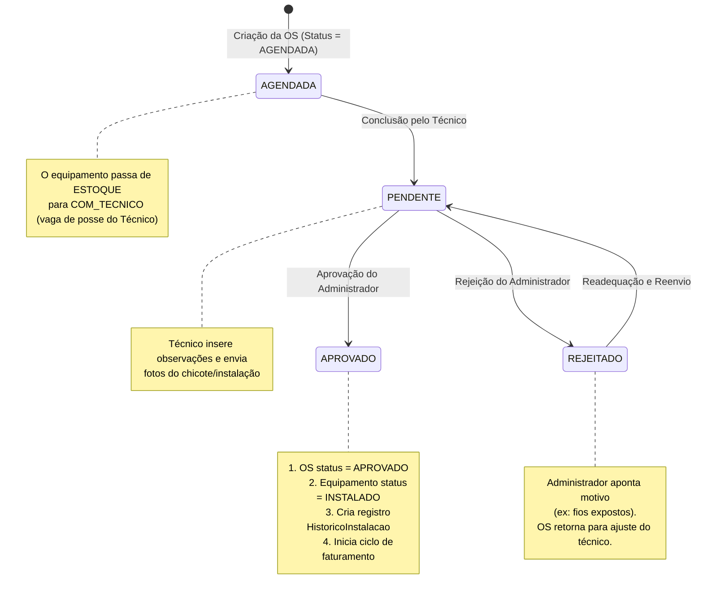
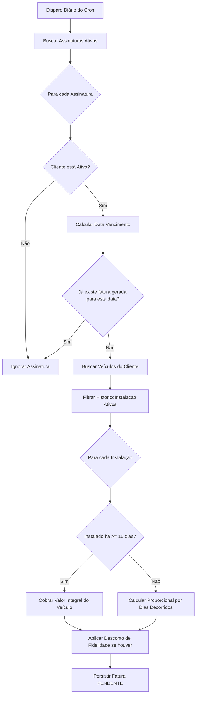

# ⚙️ Regras e Fluxos de Negócio Detalhados

Este documento analisa de forma profunda as três lógicas de backoffice mais complexas do ecossistema **AP RASTRO**: o ciclo de vida das Ordens de Serviço (O.S.), o motor de faturamento automático (com prorrata de 15 dias) e o fluxo de checkout e baixa de faturas.

---

## 🛠️ 1. Ciclo de Vida da Ordem de Serviço (O.S.) e Logística de Estoque

O controle de equipamentos (rastreadores e chips) é rigidamente integrado às transições de estado das Ordens de Serviço. O objetivo é evitar desvio de estoque e garantir precisão sobre a localização física do hardware.

### Estados do Equipamento:
*   `ESTOQUE`: O rastreador está fisicamente armazenado na central.
*   `COM_TECNICO`: O rastreador foi transferido sob a custódia do técnico de campo.
*   `INSTALADO`: O hardware foi ativado eletricamente e vinculado a um veículo do cliente.
*   `DEFEITUOSO`: O equipamento apresentou falhas e retornou para reparos.
*   `DEV_FORNECEDOR`: O equipamento foi devolvido para a fabricante (garantia).

### Fluxo da O.S. e Transição de Status:

### Garantia de Atomicidade via Transação no Mongoose
No endpoint de aprovação da O.S. (`approveOrdem`), a API executa quatro operações críticas:
1.  Atualização da O.S. para `'APROVADO'`.
2.  Preenchimento da data de resolução técnica.
3.  Alteração do status do Rastreador para `'INSTALADO'`.
4.  Criação do documento de `HistoricoInstalacao`.

Para garantir que o banco de dados não fique inconsistente (ex: aprovar a O.S., mas falhar ao marcar o rastreador como instalado), a API emprega sessões transacionais do MongoDB (`session.startTransaction()`).
> [!IMPORTANT]
> **Compatibilidade Local (`IS_LOCAL_DB`)**: Bancos de dados locais MongoDB sem Replica Set habilitado não suportam transações. Por esse motivo, a API verifica a variável de ambiente `IS_LOCAL_DB === 'true'`. Caso ativa, ela desativa automaticamente o encapsulamento em `session` para evitar erros em ambiente de desenvolvimento local.

---

## 💳 2. Motor de Faturamento Automático (Cron Job)

O motor financeiro roda diariamente em segundo plano por meio de um agendamento do `node-cron`. A lógica de processamento mapeia e calcula faturas recorrentes de forma justa e otimizada.

### Fluxograma do Processamento de Faturamento:

### Lógica de Cálculo de Planos (`tipoCobranca`)
O valor cheio mensal do rastreador é obtido dinamicamente com base nas regras do plano associado à assinatura do cliente:
*   `POR_VEICULO`: O valor mensal total é o número de veículos cobrados de forma integral multiplicado pelo `valorBase` do plano.
*   `FIXO_GLOBAL`: A mensalidade é um valor fixo corporativo e estático (`plano.valorBase`), independente do tamanho da frota em campo.
*   `ESCALONADO_FROTA`: O valor é calculado a partir de uma tabela regressiva. O sistema conta os veículos elegíveis, localiza a faixa de preço adequada e aplica o valor unitário correspondente:
    -   *Exemplo*: Se o plano tem faixas `1-10` a R$ 55,00 e `11-50` a R$ 45.00: com 12 veículos instalados, todos os 12 serão cobrados a R$ 45,00 unitários.

### Regra de Prorrateamento (Prorrata de 15 Dias)
Se um rastreador foi instalado no meio do mês de cobrança, a cobrança cheia do primeiro mês pode ser injusta para o cliente. O AP RASTRO resolve isso com uma **regra de prorroata baseada em 15 dias**:
1.  O sistema calcula a diferença em dias entre a data de instalação (`dataInstalacao` gravada no histórico) e o dia de vencimento programado da fatura.
2.  **Se a diferença for igual ou maior que 15 dias**: O veículo é classificado como "veículo cheio" e cobrado integralmente pelo valor mensal.
3.  **Se a diferença for menor que 15 dias**: O faturamento calcula o custo proporcional do rastreador:
    $$\text{Valor Proporcional} = \left( \frac{\text{Valor Unitário do Veículo}}{\text{Dias Totais do Mês Corrente}} \right) \times \text{Dias Instalados}$$
    O sistema insere uma linha descritiva individual na fatura sinalizando a cobrança proporcional para clareza do cliente.

---

## 🧾 3. Checkout e Regra de Faturamento Residual (Pagamentos Parciais)

Quando o operador recebe um pagamento e realiza o checkout da fatura (via endpoint `/api/financeiro/:id/checkout`), o sistema processa multas, descontos e valida se o valor pago cobre a dívida.

### A. Liquidação Total
-   Se `valorPago` for maior ou igual ao `valorTotal` (ajustado por eventuais descontos ou acréscimos aplicados na hora da transação):
    -   A fatura é marcada como `'PAGO'`.
    -   É gerado um registro na coleção `pagamentos` com status `'CONCLUIDO'`.
    -   São criados lançamentos na coleção `ajustefinanceiros` em caso de aplicação de descontos manuais (`DESCONTO_MANUAL`) ou multas/juros (`MULTA`).

### B. Liquidação Parcial (Geração Automática de Fatura Residual)
-   Se o cliente paga um valor menor que o total devido (`valorPago < valorTotal` após ajustes), a API impede que a pendência seja esquecida executando a divisão da fatura:
    1.  A fatura original tem seu status atualizado para `'PARCIAL'`, registrando o `valorPago` cumulativamente.
    2.  O pagamento parcial é persistido na coleção `pagamentos` para fins de fluxo de caixa técnico.
    3.  O saldo restante devedor é calculado:
        $$\text{Saldo Devedor Residual} = (\text{Valor Original} + \text{Acréscimos} - \text{Descontos}) - \text{Valor Pago}$$
    4.  **Uma nova fatura é criada automaticamente no banco**:
        -   Status inicial: `'PENDENTE'`.
        -   Data de vencimento: Definida pela nova data especificada pelo operador no ato do checkout (`novaDataVencimento`).
        -   Item de cobrança na linha: `"Resíduo da fatura parcial (Protocolo PGT-XXXXX)"`.
        -   Valor total: Saldo devedor residual calculado.
